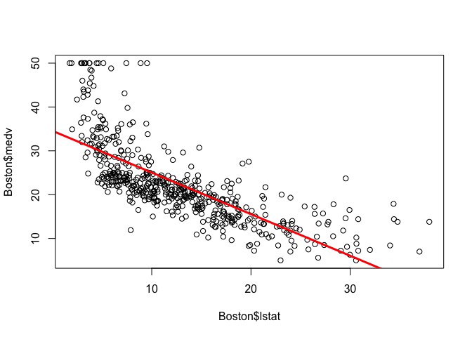
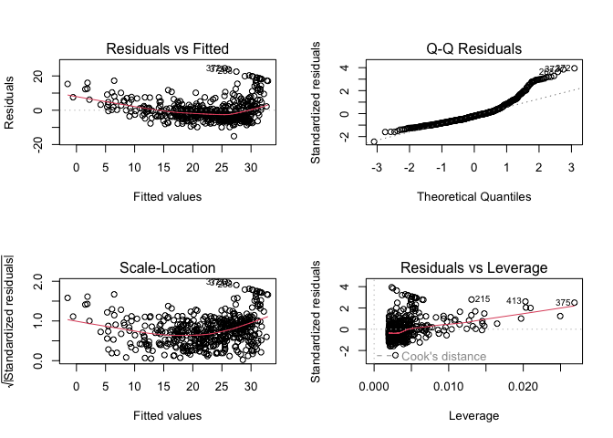
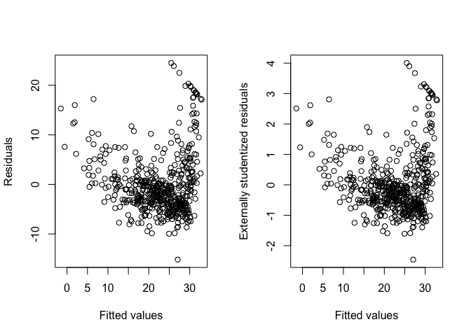
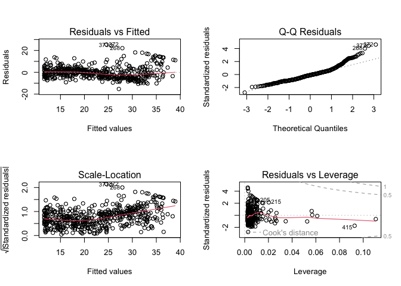

# 3.6.2 Simple Linear Regression

data set: Boston

y : medv 房價中位數（單位：千美元）

x : lstat 低社經地位人口比例 (%)

    lm.fit = lm(medv ~ lstat, data = Boston)
    summary(lm.fit)

    ## 
    ## Call:
    ## lm(formula = medv ~ lstat, data = Boston)
    ## 
    ## Residuals:
    ##     Min      1Q  Median      3Q     Max 
    ## -15.168  -3.990  -1.318   2.034  24.500 
    ## 
    ## Coefficients:
    ##             Estimate Std. Error t value Pr(>|t|)    
    ## (Intercept) 34.55384    0.56263   61.41   <2e-16 ***
    ## lstat       -0.95005    0.03873  -24.53   <2e-16 ***
    ## ---
    ## Signif. codes:  0 '***' 0.001 '**' 0.01 '*' 0.05 '.' 0.1 ' ' 1
    ## 
    ## Residual standard error: 6.216 on 504 degrees of freedom
    ## Multiple R-squared:  0.5441, Adjusted R-squared:  0.5432 
    ## F-statistic: 601.6 on 1 and 504 DF,  p-value: < 2.2e-16

## Confidence Interval and Prediction Intervals

    confint(lm.fit)

    ##                 2.5 %     97.5 %
    ## (Intercept) 33.448457 35.6592247
    ## lstat       -1.026148 -0.8739505

    predict(lm.fit, data.frame(lstat = c(5, 10, 15)),
            interval = "prediction")

    ##        fit       lwr      upr
    ## 1 29.80359 17.565675 42.04151
    ## 2 25.05335 12.827626 37.27907
    ## 3 20.30310  8.077742 32.52846

## Plot

    plot(Boston$lstat, Boston$medv)
    abline(lm.fit, lwd = 3, col = "red")

1.  Residual vs Fitted：檢查線性關係、與變異數是否同質。

2.  Normal Q-Q：檢查殘差是否近似常態分配。

3.  Scale-Location：檢查同質變異（同1.
    Y爲$\sqrt(|standardized \\residuals|)$）

4.  Residual vs Leverage：找出高影響（Influential
    Observation）的觀察值。

<!-- -->

    par(mfrow = c(2, 2))
    plot(lm.fit)

## Residuals and Studentized Residuals

studentized residuals &gt; rstudent() :把第 i
個觀測值拿掉後，用剩下的資料估計誤差標準差，最後去標準化第 i 個殘差

    par(mfrow = c(1,2))

    plot(fitted(lm.fit),
         residuals(lm.fit),
         xlab = "Fitted values",
         ylab = "Residuals")

    plot(fitted(lm.fit),
         rstudent(lm.fit),
         xlab = "Fitted values",
         ylab = "Externally studentized residuals"
         )

    #predict(lm.fit) as y hat

# 3.6.3 Multiple Linear Regression

    lm.fit.m = lm(medv ~ lstat + age, data = Boston)
    summary(lm.fit.m)

    ## 
    ## Call:
    ## lm(formula = medv ~ lstat + age, data = Boston)
    ## 
    ## Residuals:
    ##     Min      1Q  Median      3Q     Max 
    ## -15.981  -3.978  -1.283   1.968  23.158 
    ## 
    ## Coefficients:
    ##             Estimate Std. Error t value Pr(>|t|)    
    ## (Intercept) 33.22276    0.73085  45.458  < 2e-16 ***
    ## lstat       -1.03207    0.04819 -21.416  < 2e-16 ***
    ## age          0.03454    0.01223   2.826  0.00491 ** 
    ## ---
    ## Signif. codes:  0 '***' 0.001 '**' 0.01 '*' 0.05 '.' 0.1 ' ' 1
    ## 
    ## Residual standard error: 6.173 on 503 degrees of freedom
    ## Multiple R-squared:  0.5513, Adjusted R-squared:  0.5495 
    ## F-statistic:   309 on 2 and 503 DF,  p-value: < 2.2e-16

## Full Model

    # using all predictors
    lm.fit.all = lm(medv ~ ., data=Boston)
    summary(lm.fit.all)

    ## 
    ## Call:
    ## lm(formula = medv ~ ., data = Boston)
    ## 
    ## Residuals:
    ##      Min       1Q   Median       3Q      Max 
    ## -15.1304  -2.7673  -0.5814   1.9414  26.2526 
    ## 
    ## Coefficients:
    ##               Estimate Std. Error t value Pr(>|t|)    
    ## (Intercept)  41.617270   4.936039   8.431 3.79e-16 ***
    ## crim         -0.121389   0.033000  -3.678 0.000261 ***
    ## zn            0.046963   0.013879   3.384 0.000772 ***
    ## indus         0.013468   0.062145   0.217 0.828520    
    ## chas          2.839993   0.870007   3.264 0.001173 ** 
    ## nox         -18.758022   3.851355  -4.870 1.50e-06 ***
    ## rm            3.658119   0.420246   8.705  < 2e-16 ***
    ## age           0.003611   0.013329   0.271 0.786595    
    ## dis          -1.490754   0.201623  -7.394 6.17e-13 ***
    ## rad           0.289405   0.066908   4.325 1.84e-05 ***
    ## tax          -0.012682   0.003801  -3.337 0.000912 ***
    ## ptratio      -0.937533   0.132206  -7.091 4.63e-12 ***
    ## lstat        -0.552019   0.050659 -10.897  < 2e-16 ***
    ## ---
    ## Signif. codes:  0 '***' 0.001 '**' 0.01 '*' 0.05 '.' 0.1 ' ' 1
    ## 
    ## Residual standard error: 4.798 on 493 degrees of freedom
    ## Multiple R-squared:  0.7343, Adjusted R-squared:  0.7278 
    ## F-statistic: 113.5 on 12 and 493 DF,  p-value: < 2.2e-16

    summary(lm.fit.all)$r.sq # R squared

    ## [1] 0.734307

    summary(lm.fit.all)$sigma 

    ## [1] 4.798034

# Variance Inflation Factor(VIF)

    #library(car)
    vif(lm.fit.all)

    ##     crim       zn    indus     chas      nox       rm      age      dis 
    ## 1.767486 2.298459 3.987181 1.071168 4.369093 1.912532 3.088232 3.954037 
    ##      rad      tax  ptratio    lstat 
    ## 7.445301 9.002158 1.797060 2.870777

    #age has a high p-value
    lm.fit1 = lm(medv ~. - age, data = Boston)
    summary(lm.fit1)

    ## 
    ## Call:
    ## lm(formula = medv ~ . - age, data = Boston)
    ## 
    ## Residuals:
    ##      Min       1Q   Median       3Q      Max 
    ## -15.1851  -2.7330  -0.6116   1.8555  26.3838 
    ## 
    ## Coefficients:
    ##               Estimate Std. Error t value Pr(>|t|)    
    ## (Intercept)  41.525128   4.919684   8.441 3.52e-16 ***
    ## crim         -0.121426   0.032969  -3.683 0.000256 ***
    ## zn            0.046512   0.013766   3.379 0.000785 ***
    ## indus         0.013451   0.062086   0.217 0.828577    
    ## chas          2.852773   0.867912   3.287 0.001085 ** 
    ## nox         -18.485070   3.713714  -4.978 8.91e-07 ***
    ## rm            3.681070   0.411230   8.951  < 2e-16 ***
    ## dis          -1.506777   0.192570  -7.825 3.12e-14 ***
    ## rad           0.287940   0.066627   4.322 1.87e-05 ***
    ## tax          -0.012653   0.003796  -3.333 0.000923 ***
    ## ptratio      -0.934649   0.131653  -7.099 4.39e-12 ***
    ## lstat        -0.547409   0.047669 -11.483  < 2e-16 ***
    ## ---
    ## Signif. codes:  0 '***' 0.001 '**' 0.01 '*' 0.05 '.' 0.1 ' ' 1
    ## 
    ## Residual standard error: 4.794 on 494 degrees of freedom
    ## Multiple R-squared:  0.7343, Adjusted R-squared:  0.7284 
    ## F-statistic: 124.1 on 11 and 494 DF,  p-value: < 2.2e-16

## 3.6.4 Interaction

    lm.fit.interaction = lm(medv ~ lstat * age, data = Boston)
    summary(lm.fit.interaction)

    ## 
    ## Call:
    ## lm(formula = medv ~ lstat * age, data = Boston)
    ## 
    ## Residuals:
    ##     Min      1Q  Median      3Q     Max 
    ## -15.806  -4.045  -1.333   2.085  27.552 
    ## 
    ## Coefficients:
    ##               Estimate Std. Error t value Pr(>|t|)    
    ## (Intercept) 36.0885359  1.4698355  24.553  < 2e-16 ***
    ## lstat       -1.3921168  0.1674555  -8.313 8.78e-16 ***
    ## age         -0.0007209  0.0198792  -0.036   0.9711    
    ## lstat:age    0.0041560  0.0018518   2.244   0.0252 *  
    ## ---
    ## Signif. codes:  0 '***' 0.001 '**' 0.01 '*' 0.05 '.' 0.1 ' ' 1
    ## 
    ## Residual standard error: 6.149 on 502 degrees of freedom
    ## Multiple R-squared:  0.5557, Adjusted R-squared:  0.5531 
    ## F-statistic: 209.3 on 3 and 502 DF,  p-value: < 2.2e-16

## 3.6.5 Non-linear Transformations of the Predictors

$ Y = \_0 + \_1 x + \_2 x^2 + $

    lm.fit2 = lm(medv ~ lstat + I(lstat^2), data = Boston)
    #I() 將裡面的內容當作一般數學運算，不當成公式語法
    summary(lm.fit2)

    ## 
    ## Call:
    ## lm(formula = medv ~ lstat + I(lstat^2), data = Boston)
    ## 
    ## Residuals:
    ##      Min       1Q   Median       3Q      Max 
    ## -15.2834  -3.8313  -0.5295   2.3095  25.4148 
    ## 
    ## Coefficients:
    ##              Estimate Std. Error t value Pr(>|t|)    
    ## (Intercept) 42.862007   0.872084   49.15   <2e-16 ***
    ## lstat       -2.332821   0.123803  -18.84   <2e-16 ***
    ## I(lstat^2)   0.043547   0.003745   11.63   <2e-16 ***
    ## ---
    ## Signif. codes:  0 '***' 0.001 '**' 0.01 '*' 0.05 '.' 0.1 ' ' 1
    ## 
    ## Residual standard error: 5.524 on 503 degrees of freedom
    ## Multiple R-squared:  0.6407, Adjusted R-squared:  0.6393 
    ## F-statistic: 448.5 on 2 and 503 DF,  p-value: < 2.2e-16

# ANOVA

Partial F test

Full model :
*Y* = *β*0 + *β*1*x* + *β*2*x*2 + *ϵ*

Reduced model: *Y* = *β*0 + *β*1*x* + *ϵ*

*H*0 : *β*2 = 0

    anova(lm.fit,lm.fit2)

    ## Analysis of Variance Table
    ## 
    ## Model 1: medv ~ lstat
    ## Model 2: medv ~ lstat + I(lstat^2)
    ##   Res.Df   RSS Df Sum of Sq     F    Pr(>F)    
    ## 1    504 19472                                 
    ## 2    503 15347  1    4125.1 135.2 < 2.2e-16 ***
    ## ---
    ## Signif. codes:  0 '***' 0.001 '**' 0.01 '*' 0.05 '.' 0.1 ' ' 1

    #RSS（Residual Sum of Squares） = SSE

## Plot

    par(mfrow = c(2, 2))
    plot(lm.fit2)

## Additional Polynomial terms

*Y* = *β*0 + *β*1*x* + *β*2*x*2 + *β*3*x*3 + *β*4*x*4 + *β*5*x*5 + *ϵ*

    #poly()
    #lm(medv ~ log(rm), data = Boston)) #log transformation
    lm.fit5 = lm(medv ~ poly(lstat, 5), data = Boston)
    summary(lm.fit5)

    ## 
    ## Call:
    ## lm(formula = medv ~ poly(lstat, 5), data = Boston)
    ## 
    ## Residuals:
    ##      Min       1Q   Median       3Q      Max 
    ## -13.5433  -3.1039  -0.7052   2.0844  27.1153 
    ## 
    ## Coefficients:
    ##                  Estimate Std. Error t value Pr(>|t|)    
    ## (Intercept)       22.5328     0.2318  97.197  < 2e-16 ***
    ## poly(lstat, 5)1 -152.4595     5.2148 -29.236  < 2e-16 ***
    ## poly(lstat, 5)2   64.2272     5.2148  12.316  < 2e-16 ***
    ## poly(lstat, 5)3  -27.0511     5.2148  -5.187 3.10e-07 ***
    ## poly(lstat, 5)4   25.4517     5.2148   4.881 1.42e-06 ***
    ## poly(lstat, 5)5  -19.2524     5.2148  -3.692 0.000247 ***
    ## ---
    ## Signif. codes:  0 '***' 0.001 '**' 0.01 '*' 0.05 '.' 0.1 ' ' 1
    ## 
    ## Residual standard error: 5.215 on 500 degrees of freedom
    ## Multiple R-squared:  0.6817, Adjusted R-squared:  0.6785 
    ## F-statistic: 214.2 on 5 and 500 DF,  p-value: < 2.2e-16

# 3.6.6 Qualitative Predictors

    head(Carseats)

    ##   Sales CompPrice Income Advertising Population Price ShelveLoc Age Education
    ## 1  9.50       138     73          11        276   120       Bad  42        17
    ## 2 11.22       111     48          16        260    83      Good  65        10
    ## 3 10.06       113     35          10        269    80    Medium  59        12
    ## 4  7.40       117    100           4        466    97    Medium  55        14
    ## 5  4.15       141     64           3        340   128       Bad  38        13
    ## 6 10.81       124    113          13        501    72       Bad  78        16
    ##   Urban  US
    ## 1   Yes Yes
    ## 2   Yes Yes
    ## 3   Yes Yes
    ## 4   Yes Yes
    ## 5   Yes  No
    ## 6    No Yes

.＝其他所有變數；:＝只加入兩個變數的乘積交互作用；*＝兩個主效果加上交互作用。
note ‘:’ 與 ’*’ 的功能不一樣

    lm.fit.q = lm(Sales ~ . + Income:Advertising + Price:Age, data = Carseats)
    summary(lm.fit.q)

    ## 
    ## Call:
    ## lm(formula = Sales ~ . + Income:Advertising + Price:Age, data = Carseats)
    ## 
    ## Residuals:
    ##     Min      1Q  Median      3Q     Max 
    ## -2.9208 -0.7503  0.0177  0.6754  3.3413 
    ## 
    ## Coefficients:
    ##                      Estimate Std. Error t value Pr(>|t|)    
    ## (Intercept)         6.5755654  1.0087470   6.519 2.22e-10 ***
    ## CompPrice           0.0929371  0.0041183  22.567  < 2e-16 ***
    ## Income              0.0108940  0.0026044   4.183 3.57e-05 ***
    ## Advertising         0.0702462  0.0226091   3.107 0.002030 ** 
    ## Population          0.0001592  0.0003679   0.433 0.665330    
    ## Price              -0.1008064  0.0074399 -13.549  < 2e-16 ***
    ## ShelveLocGood       4.8486762  0.1528378  31.724  < 2e-16 ***
    ## ShelveLocMedium     1.9532620  0.1257682  15.531  < 2e-16 ***
    ## Age                -0.0579466  0.0159506  -3.633 0.000318 ***
    ## Education          -0.0208525  0.0196131  -1.063 0.288361    
    ## UrbanYes            0.1401597  0.1124019   1.247 0.213171    
    ## USYes              -0.1575571  0.1489234  -1.058 0.290729    
    ## Income:Advertising  0.0007510  0.0002784   2.698 0.007290 ** 
    ## Price:Age           0.0001068  0.0001333   0.801 0.423812    
    ## ---
    ## Signif. codes:  0 '***' 0.001 '**' 0.01 '*' 0.05 '.' 0.1 ' ' 1
    ## 
    ## Residual standard error: 1.011 on 386 degrees of freedom
    ## Multiple R-squared:  0.8761, Adjusted R-squared:  0.8719 
    ## F-statistic:   210 on 13 and 386 DF,  p-value: < 2.2e-16

## Dummy variable coding

貨架位置（ShelveLoc): Bad（差）、Medium（中）、Good（好）。

Bad 是 reference level。

ShelveLocGood: Good 相對於Bad的平均差異。

ShelveLocGood: Medium相對於Bad的平均差異。

    contrasts(Carseats$ShelveLoc)

    ##        Good Medium
    ## Bad       0      0
    ## Good      1      0
    ## Medium    0      1
