# Applied

## Exercise 8

    head(Auto)

    ##   mpg cylinders displacement horsepower weight acceleration year origin
    ## 1  18         8          307        130   3504         12.0   70      1
    ## 2  15         8          350        165   3693         11.5   70      1
    ## 3  18         8          318        150   3436         11.0   70      1
    ## 4  16         8          304        150   3433         12.0   70      1
    ## 5  17         8          302        140   3449         10.5   70      1
    ## 6  15         8          429        198   4341         10.0   70      1
    ##                        name
    ## 1 chevrolet chevelle malibu
    ## 2         buick skylark 320
    ## 3        plymouth satellite
    ## 4             amc rebel sst
    ## 5               ford torino
    ## 6          ford galaxie 500

Y: mpg, 每加侖可行駛英里數（Miles per Gallon）

X: horsepower, 馬力

*Ŷ* = 39.935861 − 0.157845*X*

    lm.fit = lm(mpg ~ horsepower, data = Auto)
    summary(lm.fit)

    ## 
    ## Call:
    ## lm(formula = mpg ~ horsepower, data = Auto)
    ## 
    ## Residuals:
    ##      Min       1Q   Median       3Q      Max 
    ## -13.5710  -3.2592  -0.3435   2.7630  16.9240 
    ## 
    ## Coefficients:
    ##              Estimate Std. Error t value Pr(>|t|)    
    ## (Intercept) 39.935861   0.717499   55.66   <2e-16 ***
    ## horsepower  -0.157845   0.006446  -24.49   <2e-16 ***
    ## ---
    ## Signif. codes:  0 '***' 0.001 '**' 0.01 '*' 0.05 '.' 0.1 ' ' 1
    ## 
    ## Residual standard error: 4.906 on 390 degrees of freedom
    ## Multiple R-squared:  0.6059, Adjusted R-squared:  0.6049 
    ## F-statistic: 599.7 on 1 and 390 DF,  p-value: < 2.2e-16

### Confidence Interval and Prediction Interval

    confint(lm.fit)

    ##                 2.5 %     97.5 %
    ## (Intercept) 38.525212 41.3465103
    ## horsepower  -0.170517 -0.1451725

    predict(lm.fit, data.frame(horsepower = c(98)),
            interval = "prediction")

    ##        fit     lwr      upr
    ## 1 24.46708 14.8094 34.12476

### Plot

    plot(y = Auto$mpg, x = Auto$horsepower)
    abline(lm.fit, lwd = 3, col = "red")

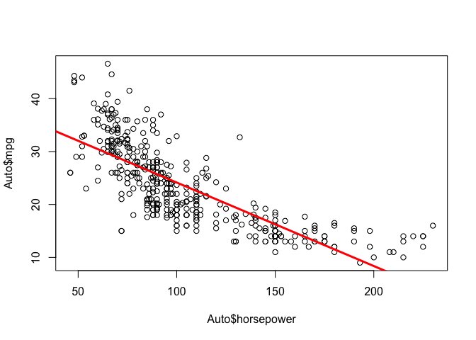

### Diagnostic plots

    par(mfrow = c(2, 2))
    plot(lm.fit)

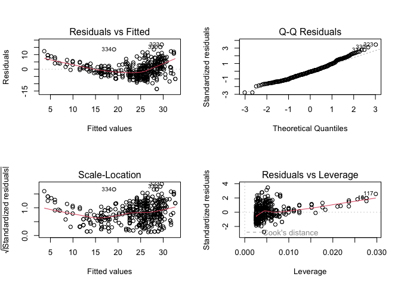

Residuals vs Fitted 有點U型彎曲，故以下加入
*h**o**r**s**e**p**o**w**e**r*2

This suggests that the linearity assumption may be violated. Therefore,
a quadratic term is added.

    lm.fit.2 = lm(mpg ~ horsepower + I(horsepower^2), data = Auto)
    par(mfrow = c(2, 2))
    plot(lm.fit.2)

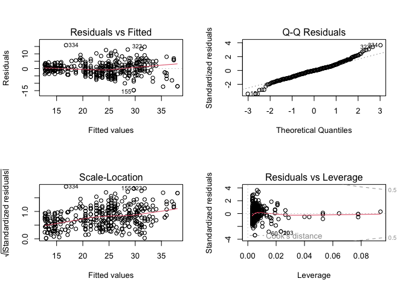

## Exercise 9

### Scatterplot Matrix

    pairs(Auto[1:8])

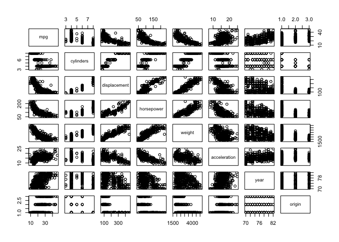

### Correlation matrix

    names(Auto)

    ## [1] "mpg"          "cylinders"    "displacement" "horsepower"   "weight"      
    ## [6] "acceleration" "year"         "origin"       "name"

    cor(Auto[1:8])

    ##                     mpg  cylinders displacement horsepower     weight
    ## mpg           1.0000000 -0.7776175   -0.8051269 -0.7784268 -0.8322442
    ## cylinders    -0.7776175  1.0000000    0.9508233  0.8429834  0.8975273
    ## displacement -0.8051269  0.9508233    1.0000000  0.8972570  0.9329944
    ## horsepower   -0.7784268  0.8429834    0.8972570  1.0000000  0.8645377
    ## weight       -0.8322442  0.8975273    0.9329944  0.8645377  1.0000000
    ## acceleration  0.4233285 -0.5046834   -0.5438005 -0.6891955 -0.4168392
    ## year          0.5805410 -0.3456474   -0.3698552 -0.4163615 -0.3091199
    ## origin        0.5652088 -0.5689316   -0.6145351 -0.4551715 -0.5850054
    ##              acceleration       year     origin
    ## mpg             0.4233285  0.5805410  0.5652088
    ## cylinders      -0.5046834 -0.3456474 -0.5689316
    ## displacement   -0.5438005 -0.3698552 -0.6145351
    ## horsepower     -0.6891955 -0.4163615 -0.4551715
    ## weight         -0.4168392 -0.3091199 -0.5850054
    ## acceleration    1.0000000  0.2903161  0.2127458
    ## year            0.2903161  1.0000000  0.1815277
    ## origin          0.2127458  0.1815277  1.0000000

### Multiple Regression

    lm.fit.full = lm(mpg ~. -name ,data = Auto)
    summary(lm.fit.full)

    ## 
    ## Call:
    ## lm(formula = mpg ~ . - name, data = Auto)
    ## 
    ## Residuals:
    ##     Min      1Q  Median      3Q     Max 
    ## -9.5903 -2.1565 -0.1169  1.8690 13.0604 
    ## 
    ## Coefficients:
    ##                Estimate Std. Error t value Pr(>|t|)    
    ## (Intercept)  -17.218435   4.644294  -3.707  0.00024 ***
    ## cylinders     -0.493376   0.323282  -1.526  0.12780    
    ## displacement   0.019896   0.007515   2.647  0.00844 ** 
    ## horsepower    -0.016951   0.013787  -1.230  0.21963    
    ## weight        -0.006474   0.000652  -9.929  < 2e-16 ***
    ## acceleration   0.080576   0.098845   0.815  0.41548    
    ## year           0.750773   0.050973  14.729  < 2e-16 ***
    ## origin         1.426141   0.278136   5.127 4.67e-07 ***
    ## ---
    ## Signif. codes:  0 '***' 0.001 '**' 0.01 '*' 0.05 '.' 0.1 ' ' 1
    ## 
    ## Residual standard error: 3.328 on 384 degrees of freedom
    ## Multiple R-squared:  0.8215, Adjusted R-squared:  0.8182 
    ## F-statistic: 252.4 on 7 and 384 DF,  p-value: < 2.2e-16

### Diagnostic plots

    par(mfrow = c(2, 2))
    plot(lm.fit.full)

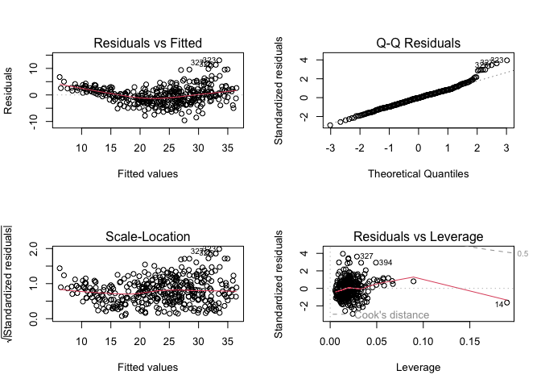

    which.max(cooks.distance(lm.fit.full))

    ## 14 
    ## 14

    max(cooks.distance(lm.fit.full))

    ## [1] 0.07780084

### Interaction terms

    names(Auto)

    ## [1] "mpg"          "cylinders"    "displacement" "horsepower"   "weight"      
    ## [6] "acceleration" "year"         "origin"       "name"

    lm.fit.interaction <- lm(
      mpg ~ (cylinders + displacement + horsepower + weight +
               acceleration + year + origin)^2,
      data = Auto
    )

    #只看兩兩交互作用的效果 ^2 (pairwise interaction)
    summary(lm.fit.interaction)

    ## 
    ## Call:
    ## lm(formula = mpg ~ (cylinders + displacement + horsepower + weight + 
    ##     acceleration + year + origin)^2, data = Auto)
    ## 
    ## Residuals:
    ##     Min      1Q  Median      3Q     Max 
    ## -7.6303 -1.4481  0.0596  1.2739 11.1386 
    ## 
    ## Coefficients:
    ##                             Estimate Std. Error t value Pr(>|t|)   
    ## (Intercept)                3.548e+01  5.314e+01   0.668  0.50475   
    ## cylinders                  6.989e+00  8.248e+00   0.847  0.39738   
    ## displacement              -4.785e-01  1.894e-01  -2.527  0.01192 * 
    ## horsepower                 5.034e-01  3.470e-01   1.451  0.14769   
    ## weight                     4.133e-03  1.759e-02   0.235  0.81442   
    ## acceleration              -5.859e+00  2.174e+00  -2.696  0.00735 **
    ## year                       6.974e-01  6.097e-01   1.144  0.25340   
    ## origin                    -2.090e+01  7.097e+00  -2.944  0.00345 **
    ## cylinders:displacement    -3.383e-03  6.455e-03  -0.524  0.60051   
    ## cylinders:horsepower       1.161e-02  2.420e-02   0.480  0.63157   
    ## cylinders:weight           3.575e-04  8.955e-04   0.399  0.69000   
    ## cylinders:acceleration     2.779e-01  1.664e-01   1.670  0.09584 . 
    ## cylinders:year            -1.741e-01  9.714e-02  -1.793  0.07389 . 
    ## cylinders:origin           4.022e-01  4.926e-01   0.816  0.41482   
    ## displacement:horsepower   -8.491e-05  2.885e-04  -0.294  0.76867   
    ## displacement:weight        2.472e-05  1.470e-05   1.682  0.09342 . 
    ## displacement:acceleration -3.479e-03  3.342e-03  -1.041  0.29853   
    ## displacement:year          5.934e-03  2.391e-03   2.482  0.01352 * 
    ## displacement:origin        2.398e-02  1.947e-02   1.232  0.21875   
    ## horsepower:weight         -1.968e-05  2.924e-05  -0.673  0.50124   
    ## horsepower:acceleration   -7.213e-03  3.719e-03  -1.939  0.05325 . 
    ## horsepower:year           -5.838e-03  3.938e-03  -1.482  0.13916   
    ## horsepower:origin          2.233e-03  2.930e-02   0.076  0.93931   
    ## weight:acceleration        2.346e-04  2.289e-04   1.025  0.30596   
    ## weight:year               -2.245e-04  2.127e-04  -1.056  0.29182   
    ## weight:origin             -5.789e-04  1.591e-03  -0.364  0.71623   
    ## acceleration:year          5.562e-02  2.558e-02   2.174  0.03033 * 
    ## acceleration:origin        4.583e-01  1.567e-01   2.926  0.00365 **
    ## year:origin                1.393e-01  7.399e-02   1.882  0.06062 . 
    ## ---
    ## Signif. codes:  0 '***' 0.001 '**' 0.01 '*' 0.05 '.' 0.1 ' ' 1
    ## 
    ## Residual standard error: 2.695 on 363 degrees of freedom
    ## Multiple R-squared:  0.8893, Adjusted R-squared:  0.8808 
    ## F-statistic: 104.2 on 28 and 363 DF,  p-value: < 2.2e-16

### Transformations of the variables

Try a few different transformations of the variables, such as log(X), √X,
X^2. Comment on your findings.

x: horsepower

y: mpg

sqrt : $Y = \beta \_0 + \beta \_1\sqrt{X} + \epsilon$

log : *Y* = *β*0 + *β*1ln *X* + *ϵ*

squared: *Y* = *β*0 + *β*1*X*2 + *ϵ*

poly:
*Y* = *β*0 + *β*1*X*1 + *β*2*X*22 + *ϵ*

    lm.fit.sqrt = lm(mpg ~ sqrt(horsepower), data = Auto)
    lm.fit.log = lm(mpg ~ log(horsepower), data = Auto)
    lm.fit.squared = lm(mpg ~ I(horsepower^2), data = Auto)
    lm.fit.poly.squared = lm(mpg ~ horsepower + I(horsepower^2), data = Auto)

    par(mfrow = c(1,3))
    plot(
      sqrt(Auto$horsepower), Auto$mpg,
      xlab = "sqrt(horsepower)",
      ylab = "mpg",
      main = "Square-root transformation"
    )
    abline(lm.fit.sqrt, lwd = 3, col = "red")

    plot(
      log(Auto$horsepower), Auto$mpg,
      xlab = "log(horsepower)",
      ylab = "mpg",
      main = "Log transformation"
    )
    abline(lm.fit.log, lwd = 3, col = "blue")

    plot(
      Auto$horsepower^2, Auto$mpg,
      xlab = "horsepower^2",
      ylab = "mpg",
      main = "Squared transformation"
    )
    abline(lm.fit.squared, lwd = 3, col = "green")

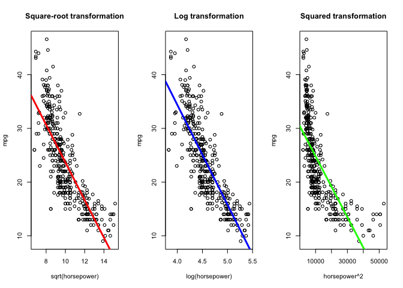

    par(mfrow = c(2, 2))

    plot(
      fitted(lm.fit.sqrt),
      rstudent(lm.fit.sqrt),
      xlab = "Fitted values",
      ylab = "Studentized residuals",
      main = "sqrt(horsepower)"
    )
    abline(h = 0, lty = 2)

    plot(
      fitted(lm.fit.log),
      rstudent(lm.fit.log),
      xlab = "Fitted values",
      ylab = "Studentized residuals",
      main = "log(horsepower)"
    )
    abline(h = 0, lty = 2)

    plot(
      fitted(lm.fit.squared),
      rstudent(lm.fit.squared),
      xlab = "Fitted values",
      ylab = "Studentized residuals",
      main = "horsepower^2"
    )
    abline(h = 0, lty = 2)

    plot(
      fitted(lm.fit.poly.squared),
      rstudent(lm.fit.poly.squared),
      xlab = "Fitted values",
      ylab = "Studentized residuals",
      main = "poly(horsepower, 2)"
    )
    abline(h = 0, lty = 2)

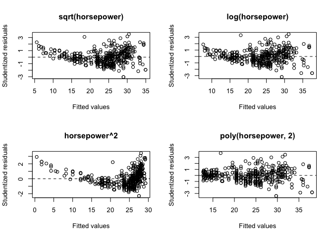

    summary(lm.fit.sqrt)$adj.r.squared

    ## [1] 0.64279

    summary(lm.fit.log)$adj.r.squared

    ## [1] 0.6674843

    summary(lm.fit.squared)$adj.r.squared

    ## [1] 0.5061038

    sigma(lm.fit.sqrt)

    ## [1] 4.664823

    sigma(lm.fit.log)

    ## [1] 4.500693

    sigma(lm.fit.squared)

    ## [1] 5.485183

## Exercise 13

*X* ∼ *N*(0, 1)

*ϵ* ∼ *N*(0, 0.25)

*Y* = −1 + 0.5*X* + *ϵ*

    set.seed(1)
    x = rnorm(n = 100, mean = 0, sd = 1)
    eps = rnorm(n = 100, mean = 0, sd =sqrt(0.25))
    y = -1 + 0.5 * x + eps

*β*0 = −1, *β*1 = 0.5

$\hat{\beta \_ 0} = -0.97578 , \\\hat{\beta \_1} =0.55311$

    lm.fit.13 = lm(y ~ x)
    summary(lm.fit.13)

    ## 
    ## Call:
    ## lm(formula = y ~ x)
    ## 
    ## Residuals:
    ##      Min       1Q   Median       3Q      Max 
    ## -0.93842 -0.30688 -0.06975  0.26970  1.17309 
    ## 
    ## Coefficients:
    ##             Estimate Std. Error t value Pr(>|t|)    
    ## (Intercept) -1.01885    0.04849 -21.010  < 2e-16 ***
    ## x            0.49947    0.05386   9.273 4.58e-15 ***
    ## ---
    ## Signif. codes:  0 '***' 0.001 '**' 0.01 '*' 0.05 '.' 0.1 ' ' 1
    ## 
    ## Residual standard error: 0.4814 on 98 degrees of freedom
    ## Multiple R-squared:  0.4674, Adjusted R-squared:  0.4619 
    ## F-statistic: 85.99 on 1 and 98 DF,  p-value: 4.583e-15

### Plot

    plot(x = x, y = y)
    abline(lm.fit.13,
           lwd = 3,
           col = "red")

    abline(a = -1,
           b = 0.5,
           col = "blue",
           lwd = 3)

    legend("topleft",
           legend = c("True line",
                      "Estimated line"),
           col = c("blue", "red"),
           lwd = 3)

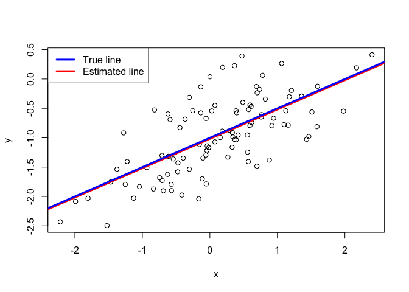

### Polynomial regression model

Reduced model: *Y* = *β*0 + *β*1*X* + *ϵ*

Full model:
*Y* = *β*0 + *β*1*X* + *β*2*X*2 + *ϵ*

Note:

I(x^2) fits the raw polynomial,

poly(x, 2) uses orthogonal polynomials.

    lm.fit.13.poly = lm(y ~ x + I(x^2))
    #note: I(x^2) 與 poly(x, 2)不同
    summary(lm.fit.13.poly)

    ## 
    ## Call:
    ## lm(formula = y ~ x + I(x^2))
    ## 
    ## Residuals:
    ##      Min       1Q   Median       3Q      Max 
    ## -0.98252 -0.31270 -0.06441  0.29014  1.13500 
    ## 
    ## Coefficients:
    ##             Estimate Std. Error t value Pr(>|t|)    
    ## (Intercept) -0.97164    0.05883 -16.517  < 2e-16 ***
    ## x            0.50858    0.05399   9.420  2.4e-15 ***
    ## I(x^2)      -0.05946    0.04238  -1.403    0.164    
    ## ---
    ## Signif. codes:  0 '***' 0.001 '**' 0.01 '*' 0.05 '.' 0.1 ' ' 1
    ## 
    ## Residual standard error: 0.479 on 97 degrees of freedom
    ## Multiple R-squared:  0.4779, Adjusted R-squared:  0.4672 
    ## F-statistic:  44.4 on 2 and 97 DF,  p-value: 2.038e-14

Partial F test: *H*0 : *β*2 = 0

Since the p-value = .722 &gt; .05, we do not reject *H*0.

There is no evidence that adding the quadratic term significiantly
improves the model.

    anova(lm.fit.13, lm.fit.13.poly)

    ## Analysis of Variance Table
    ## 
    ## Model 1: y ~ x
    ## Model 2: y ~ x + I(x^2)
    ##   Res.Df    RSS Df Sum of Sq      F Pr(>F)
    ## 1     98 22.709                           
    ## 2     97 22.257  1   0.45163 1.9682 0.1638

### Increasing/Decreasing the variance of epsilon

Repeat (a)–(f) after modifying the data generation process in such a way
that there is more noise in the data. The model (3.39) should remain the
same. You can do this by increasing the variance of the normal
distribution used to generate the error term ϵ in (b). Describe your
results.

1.  *ϵ*′ ∼ *N*(0, 0.05)

*Y* = −1 + 0.5*X* + *ϵ*′

1.  *ϵ*″ ∼ *N*(0, 0.45)

*Y* = −1 + 0.5*X* + *ϵ*″

*β*0 = −1, *β*1 = 0.5

V(ε) = 0.25 : $\hat{\beta \_ 0} = -0.97578 , \\\hat{\beta \_1} =0.55311$

V(ε) = 0.05 :
$\hat{\beta \_ 0}' = -0.99388 , \\\hat{\beta \_1}' =0.50473$

V(ε) = 0.45 :
$\hat{\beta \_ 0}'' = -0.96132 , \\\hat{\beta \_1}'' =0.46264$

    #smaller error variance
    set.seed(1)
    eps.05 = rnorm(n = 100, mean = 0, sd =sqrt(0.05))
    y.05 = -1 + 0.5 * x + eps.05

    lm.fit.le = lm(y.05 ~ x)
    summary(lm.fit.le)

    ## Warning in summary.lm(lm.fit.le): essentially perfect fit: summary may be
    ## unreliable

    ## 
    ## Call:
    ## lm(formula = y.05 ~ x)
    ## 
    ## Residuals:
    ##        Min         1Q     Median         3Q        Max 
    ## -4.866e-15 -2.870e-17  3.780e-17  1.000e-16  1.263e-15 
    ## 
    ## Coefficients:
    ##               Estimate Std. Error    t value Pr(>|t|)    
    ## (Intercept) -1.000e+00  5.204e-17 -1.921e+16   <2e-16 ***
    ## x            7.236e-01  5.781e-17  1.252e+16   <2e-16 ***
    ## ---
    ## Signif. codes:  0 '***' 0.001 '**' 0.01 '*' 0.05 '.' 0.1 ' ' 1
    ## 
    ## Residual standard error: 5.166e-16 on 98 degrees of freedom
    ## Multiple R-squared:      1,  Adjusted R-squared:      1 
    ## F-statistic: 1.567e+32 on 1 and 98 DF,  p-value: < 2.2e-16

    #greater error variance
    eps.45 = rnorm(n = 100, mean = 0, sd =sqrt(0.45))
    y.45 = -1 + 0.5 * x + eps.45
    lm.fit.ge = lm(y.45 ~ x)
    summary(lm.fit.ge)

    ## 
    ## Call:
    ## lm(formula = y.45 ~ x)
    ## 
    ## Residuals:
    ##      Min       1Q   Median       3Q      Max 
    ## -1.25902 -0.41173 -0.09358  0.36184  1.57386 
    ## 
    ## Coefficients:
    ##             Estimate Std. Error t value Pr(>|t|)    
    ## (Intercept) -1.02528    0.06506 -15.759  < 2e-16 ***
    ## x            0.49929    0.07227   6.909 4.95e-10 ***
    ## ---
    ## Signif. codes:  0 '***' 0.001 '**' 0.01 '*' 0.05 '.' 0.1 ' ' 1
    ## 
    ## Residual standard error: 0.6458 on 98 degrees of freedom
    ## Multiple R-squared:  0.3275, Adjusted R-squared:  0.3207 
    ## F-statistic: 47.74 on 1 and 98 DF,  p-value: 4.948e-10

### Plot (Comparison under Different Error Variances)

    par(mfrow = c(1, 3))
    plot(x = x, y = y, main = "V(ε) = 0.25")
    abline(lm.fit.13,
           lwd = 3,
           col = "red")

    abline(a = -1,
           b = 0.5,
           col = "blue",
           lwd = 3)

    legend("topleft",
           legend = c("True line",
                      "Estimated line"),
           col = c("blue", "red"),
           lwd = 3)

    plot(x = x, y = y.05, main = "V(ε) = 0.05")
    abline(lm.fit.le,
           lwd = 3,
           col = "red")

    abline(a = -1,
           b = 0.5,
           col = "blue",
           lwd = 3)

    legend("topleft",
           legend = c("True line",
                      "Estimated line"),
           col = c("blue", "red"),
           lwd = 3)

    plot(x = x, y = y.45, main = "V(ε) = 0.45")
    abline(lm.fit.ge,
           lwd = 3,
           col = "red")

    abline(a = -1,
           b = 0.5,
           col = "blue",
           lwd = 3)

    legend("topleft",
           legend = c("True line",
                      "Estimated line"),
           col = c("blue", "red"),
           lwd = 3)

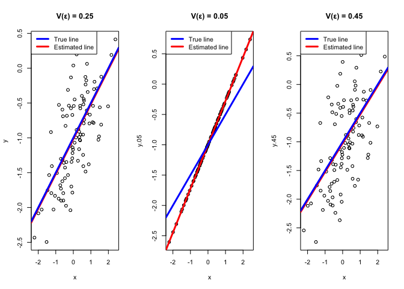

As the error variance increases,

1.  the data become more scattered.

2.  the estimated coefficients become less precise.

3.  the fitted regression line deviates more from the population
    regression line.

### Confidence Interval

    confint(lm.fit.13)

    ##                  2.5 %     97.5 %
    ## (Intercept) -1.1150804 -0.9226122
    ## x            0.3925794  0.6063602

    confint(lm.fit.le)

    ## Warning in summary.lm(object, ...): essentially perfect fit: summary may be
    ## unreliable

    ##                  2.5 %     97.5 %
    ## (Intercept) -1.0000000 -1.0000000
    ## x            0.7236068  0.7236068

    confint(lm.fit.ge)

    ##                  2.5 %     97.5 %
    ## (Intercept) -1.1543965 -0.8961734
    ## x            0.3558802  0.6426972

## Exercise 15

y : crim 每人平均犯罪率（城鎮犯罪程度）

x :

1.  crim 犯罪率

2.  zn 大地住宅比例 Numeric 面積超過 25,000 平方英尺住宅用地比例

3.  indus 非零售商業用地比例 Numeric 商業／工業發展程度

4.  nox 一氧化氮濃度, 空氣污染程度

5.  rm 平均房間數, 每戶平均房間數

6.  age 老房屋比例, 1940 年以前建成住宅比例

7.  dis 就業中心距離, 到五個 Boston 就業中心的加權距離

8.  rad 高速公路便利性, 徑向高速公路可達性指數

9.  tax 房屋稅率, 每 $10,000 房屋價值需繳的稅

10. ptratio 師生比, 城鎮學生／教師比例

11. lstat 低社經地位人口比例

12. medv 房價中位數

<!-- -->

    vars = names(Boston)[names(Boston) != "crim"]
    result = data.frame(
      Variable = vars,
      beta1 = NA,
      R2 = NA,
      pvalue = NA
    )
    #seq_along(x) = 1:length(x)
    for(i in seq_along(vars)){
      formula_text = paste("crim ~", vars[i])   #建lm()公式的string
      formula_obj = as.formula(formula_text)   #把string變成lm()的公式
      fit = lm(formula_obj, data = Boston)
      result$R2[i] = summary(fit)$r.squared
      result$pvalue[i] = summary(fit)$coefficients[2, 4]
      result$beta1[i] = summary(fit)$coefficients[2, 1]
    }

    result[order(result$R2,decreasing = T), ] 

    ##    Variable       beta1          R2       pvalue
    ## 8       rad  0.61791093 0.391256687 2.693844e-56
    ## 9       tax  0.02974225 0.339614243 2.357127e-47
    ## 11    lstat  0.54880478 0.207590933 2.654277e-27
    ## 4       nox 31.24853120 0.177217182 3.751739e-23
    ## 2     indus  0.50977633 0.165310070 1.450349e-21
    ## 12     medv -0.36315992 0.150780469 1.173987e-19
    ## 7       dis -1.55090168 0.144149375 8.519949e-19
    ## 6       age  0.10778623 0.124421452 2.854869e-16
    ## 10  ptratio  1.15198279 0.084068439 2.942922e-11
    ## 5        rm -2.68405122 0.048069117 6.346703e-07
    ## 1        zn -0.07393498 0.040187908 5.506472e-06
    ## 3      chas -1.89277655 0.003123869 2.094345e-01

    #order() return 排序之後的index

     #crim, zn, indus, chas, nox, rm, age, dis, rad, tax, ptratio, lstat, medv

All predictors except ‘chas’ show statistically significant associations
with ‘crim’ at the 5% significance level.

The strongest linear association is observed for
‘rad’(*R*2 = 0.391), followed by ‘tax’ and ‘lstat’.

    par(mfrow = c(2,2))
    plot(x = Boston$rad, y = Boston$crim)
    plot(x = Boston$medv, y = Boston$crim)
    plot(x = Boston$lstat, y = Boston$crim)
    plot(x = Boston$rm, y = Boston$crim)

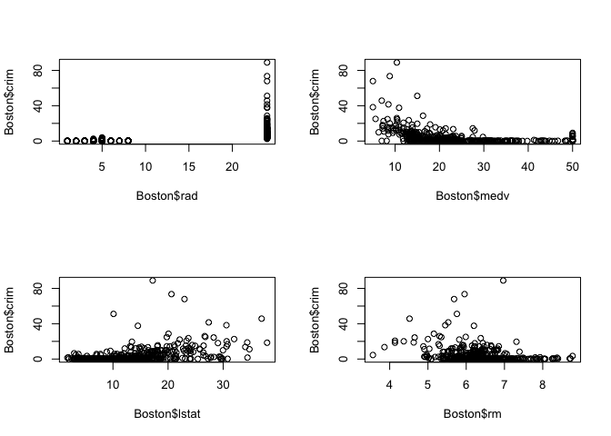

### Multiple Regression and Partial F Test

    full.model = lm(crim ~ .,data = Boston)
    summary(full.model)

    ## 
    ## Call:
    ## lm(formula = crim ~ ., data = Boston)
    ## 
    ## Residuals:
    ##    Min     1Q Median     3Q    Max 
    ## -8.534 -2.248 -0.348  1.087 73.923 
    ## 
    ## Coefficients:
    ##               Estimate Std. Error t value Pr(>|t|)    
    ## (Intercept) 13.7783938  7.0818258   1.946 0.052271 .  
    ## zn           0.0457100  0.0187903   2.433 0.015344 *  
    ## indus       -0.0583501  0.0836351  -0.698 0.485709    
    ## chas        -0.8253776  1.1833963  -0.697 0.485841    
    ## nox         -9.9575865  5.2898242  -1.882 0.060370 .  
    ## rm           0.6289107  0.6070924   1.036 0.300738    
    ## age         -0.0008483  0.0179482  -0.047 0.962323    
    ## dis         -1.0122467  0.2824676  -3.584 0.000373 ***
    ## rad          0.6124653  0.0875358   6.997 8.59e-12 ***
    ## tax         -0.0037756  0.0051723  -0.730 0.465757    
    ## ptratio     -0.3040728  0.1863598  -1.632 0.103393    
    ## lstat        0.1388006  0.0757213   1.833 0.067398 .  
    ## medv        -0.2200564  0.0598240  -3.678 0.000261 ***
    ## ---
    ## Signif. codes:  0 '***' 0.001 '**' 0.01 '*' 0.05 '.' 0.1 ' ' 1
    ## 
    ## Residual standard error: 6.46 on 493 degrees of freedom
    ## Multiple R-squared:  0.4493, Adjusted R-squared:  0.4359 
    ## F-statistic: 33.52 on 12 and 493 DF,  p-value: < 2.2e-16

Partial F test

*H*0 : *β**j* = 0

In the multiple regression model, after controlling for all other
predictors, rad, medv, dis, and zn are statistically significant at the
5% level. Therefore, we reject *H*0 : *β**j* = 0
for these four predictors.

Compared with the results in part (a), some variables, such as tax,
lstat, nox have relatively high *R*2 in the simple regression
model. However, these variables are no longer statistically significant
in the multiple regression model.

    result2 = data.frame(
      ExcludeVariable = vars,
      PartialF = NA,
      pvalue = NA
    )

    for(i in seq_along(vars)){
      formula_text = paste("crim ~. -", vars[i])  #建lm()公式的string, 除了vars[i]以外的變數都納入
      formula_obj = as.formula(formula_text)   #把string變成lm()的公式
      fit = lm(formula_obj, data = Boston)

      #names(anova(fit,full.model))
      result2$PartialF[i] = round(anova(fit,full.model)[2,"F"],4)
      result2$pvalue[i] = round(anova(fit,full.model)[2, "Pr(>F)" ],4)
    }
    result2[order(result2$pvalue , decreasing = F),]

    ##    ExcludeVariable PartialF pvalue
    ## 8              rad  48.9544 0.0000
    ## 12            medv  13.5306 0.0003
    ## 7              dis  12.8421 0.0004
    ## 1               zn   5.9177 0.0153
    ## 4              nox   3.5434 0.0604
    ## 11           lstat   3.3601 0.0674
    ## 10         ptratio   2.6623 0.1034
    ## 5               rm   1.0732 0.3007
    ## 9              tax   0.5329 0.4658
    ## 2            indus   0.4868 0.4857
    ## 3             chas   0.4865 0.4858
    ## 6              age   0.0022 0.9623

### Plot(simple regression coefficient vs multiple regression coefficient)

The largest change occurred for ‘nox’, whose coefficient changed from
31.25 in the simple regression model to −9.96 in the multiple regression
model. This sign reversal suggests strong multicollinearity with other
predictors. Several other predictors (e.g., ‘rm’, ‘ptratio’, ‘indus’,
‘zn’, and ‘age’) also exhibited sign changes, although the magnitude of
these changes was relatively smaller.

    mul.reg.coef = unname(summary(full.model)$coefficients[-1,"Estimate"])
    coef.result = cbind(result[,1:2],
                        mul.reg.coef)

    coef.diff = abs(coef.result[,2] - coef.result[,3]) #看回歸係數之差異絕對值
    coef.sign.change = sign(coef.result[,2]) != sign(coef.result[,3])#看兩回歸係數是否有變號

    coef.result = cbind(coef.result,
                        coef.diff,
                        coef.sign.change)
    names(coef.result) = c("Variable", "S.R.coef", "M.R.coef", "Coef.diff", "Coef.sign.change")

    coef.result[order(coef.result$Coef.diff, decreasing = T),]

    ##    Variable    S.R.coef      M.R.coef    Coef.diff Coef.sign.change
    ## 4       nox 31.24853120 -9.9575865471 41.206117748             TRUE
    ## 5        rm -2.68405122  0.6289106622  3.312961886             TRUE
    ## 10  ptratio  1.15198279 -0.3040727572  1.456055544             TRUE
    ## 3      chas -1.89277655 -0.8253775522  1.067398999            FALSE
    ## 2     indus  0.50977633 -0.0583501107  0.568126442             TRUE
    ## 7       dis -1.55090168 -1.0122467382  0.538654944            FALSE
    ## 11    lstat  0.54880478  0.1388005968  0.410004185            FALSE
    ## 12     medv -0.36315992 -0.2200563590  0.143103563            FALSE
    ## 1        zn -0.07393498  0.0457100386  0.119645016             TRUE
    ## 6       age  0.10778623 -0.0008482791  0.108634506             TRUE
    ## 9       tax  0.02974225 -0.0037756465  0.033517899             TRUE
    ## 8       rad  0.61791093  0.6124653115  0.005445616            FALSE

    plot(x = coef.result$S.R.coef, 
         y = coef.result$M.R.coef)

    text(
        coef.result$S.R.coef,
        coef.result$M.R.coef,
        labels = vars,
        pos = 4,
        cex = 0.8
    )

    abline(0,1,col="red",lty=2)

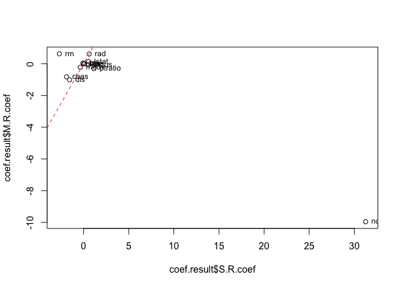

### non-linear association

full model:
*Y* = *β*0 + *β*1*X* + *β*2*X*2 + *β*3*X*3 + *ϵ*

reduced model: *Y* = *β*0 + *β*1*X* + *ϵ*

Partial F test

*H*0 : *β*2 = *β*3 = 0

For every predictor, the partial F test rejected the null hypothesis
*H*0 : *β*2 = *β*3 = 0. This indicates
that adding quadratic *β*2 and cubic *β*3 terms
significantly improves the fit compared with a simple linear regression
model, suggesting that evidence of nonlinear relationships between each
predictor and ‘crim’.

    vars = names(Boston)[
      names(Boston) != "crim" &
      names(Boston) != "chas"
    ]
    vars

    ##  [1] "zn"      "indus"   "nox"     "rm"      "age"     "dis"     "rad"    
    ##  [8] "tax"     "ptratio" "lstat"   "medv"

    result3 = data.frame(
      Variable = vars,
      beta1 = NA,
      beta2 = NA,
      beta3 = NA,
      Fvalue = NA,
      pvalue = NA
    )
    #seq_along(x) = 1:length(x)
    for(i in seq_along(vars)){
      formula_text = paste("crim ~", vars[i],
                           "+I(",vars[i],"^2)",
                           "+I(",vars[i],"^3)")   #建lm()公式的string
      formula_obj = as.formula(formula_text)   #把string變成lm()的公式
      fit = lm(formula_obj, data = Boston)
      
      formula_text.sim = paste("crim ~", vars[i])   
      formula_obj.sim = as.formula(formula_text.sim)   
      fit.sim = lm(formula_obj.sim, data = Boston)
      
      result3$beta1[i] = summary(fit)$coefficients[2, "Estimate"]
      result3$beta2[i] = summary(fit)$coefficients[3, "Estimate"]
      result3$beta3[i] = summary(fit)$coefficients[4, "Estimate"]
      result3$Fvalue[i] = anova(fit.sim, fit)[2,"F"]
      result3$pvalue[i] = round(anova(fit.sim, fit)[2,"Pr(>F)"],4)
    }
    result3[order(result3$pvalue, decreasing = F), ]

    ##    Variable         beta1         beta2         beta3     Fvalue pvalue
    ## 2     indus    -1.9652129  2.519373e-01 -6.976009e-03  31.986960 0.0000
    ## 3       nox -1279.3712517  2.248544e+03 -1.245703e+03  42.758171 0.0000
    ## 5       age     0.2736531 -7.229596e-03  5.745307e-05  15.140063 0.0000
    ## 6       dis   -15.5543535  2.452072e+00 -1.185986e-01  46.460365 0.0000
    ## 8       tax    -0.1533096  3.608266e-04 -2.203715e-07  11.640023 0.0000
    ## 11     medv    -5.0948305  1.554965e-01 -1.490103e-03 116.634006 0.0000
    ## 9   ptratio   -82.3605377  4.635347e+00 -8.476032e-02   8.415530 0.0003
    ## 4        rm   -39.1501363  4.550896e+00 -1.744770e-01   5.308817 0.0052
    ## 1        zn    -0.3321884  6.482634e-03 -3.775793e-05   4.811821 0.0085
    ## 7       rad     0.5127360 -7.517736e-02  3.208996e-03   3.673270 0.0261
    ## 10    lstat    -0.4490656  5.577942e-02 -8.573703e-04   3.319044 0.0370
